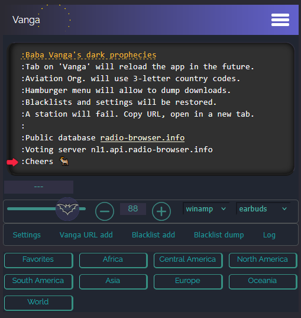
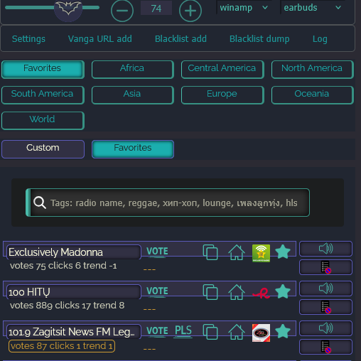
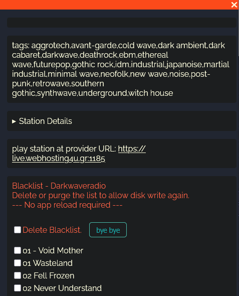

VANGA - distributed database
=============================

Overview
---------
JS Fullstack. This repository shows the source code of a distributed NoSQL database app.

Vanga takes the the datasets of the radio-browser.info MariaDB database and stores it 
for offline use inside the browsers *indexed DB*. Updates can be pulled regularly.
Datasets are customized and loaded  into the memory of the user's device, 
for rapid access and inter-thread commuciation.

Additional features like voting for a station and downloading
streams are added to improve the user experience.

The app can be considered as the successor of Python based *EisenRadio* (Link) in my repo.

The extension app can be used with FireFox on mobile Android devices and PC.

FireFox Android/PC Add-on: https://addons.mozilla.org/en-US/firefox/addon/vanga/

Help
-----
The help and documentation web page vor the latest release is located online and in the 
/docs folder of the repo.

It needs improvements for code documentation and project overview, as well as technical
documentaton. This is ongoing work.

ReadTheDocs (Python based): https://vanga.readthedocs.io/en/latest/README.html

Pictures
--------

-

-

Why
---

There are several internet radio URL databases araound the web.

The one I like the most is radio-browser.info (radio-browser). 
It is public available worldwide and also hosts TV station URLs. 
radio-browser.info is fault tolerant. There are three server online
at the moment.

A browser extension can help to make the database available for 
a broader audience.

Additional features, like voting and click charts, or recording
shall improve the value of the app.

The local copy of the database is hosted in memory and allows
super fast search over radio names and genres (tags). I took
country and continent filters buttons, because I convinced, 
that most people are more interested in a more 'local' search.

Browser Add-on Android/PC
--------------------------
Use the FireFox Add-on manager to locate ``vanga``. 

Uninstall Browser Add-on
------------------------
Remove the Add-on. ``All downloaded data are lost then``.

How it works
-------------
The Browser extension has an outdated copy of the radio-browser.info 
public database onboard and can be updated online.

The local JSON file is loaded at first run. The JSON indexed DB blob 
is loaded instead if an update was received.
Updates are allowed on a dayly basis to prevent overloading the public 
radio-browser database.

PC user can hit F12 to visit their data (FireFox 'web storage').

All data are permanently stored in the browser's IndexedDB (IDB). 
Until deinstallation. 

User setting are stored also in the IDB to survive HTML page reloads 
and browser closings.

Download feature allows to cut snippets from a station data stream and 
store them as blob in the indexed DB.
The title information of the station is stored in a blacklist IDB store 
to prevent unnessecary repeated downloads.
File blobs can be downloaded separated by station name if the next title 
was send by the station (stram cut). 

Blacklist dump allows to save all stored blacklists, as well as the 
user settings as a backup via JSON file.

The app uses a random public DB server as the session server to communicate. 
Click and vote feature sends user selected station ID to the public database. 
The app pulls every few minutes the latest dataset from the public DB API, 
for all openend station container. A badge shows the current vote and click 
counts for the station and the trend towards positive or negative numbers.

HowTo user test Android
------------------------
Clone repo from GitHub. Go to it,
install node.js and activate npm, red from package.json. 

    foobar:~$ npm install

Install 'web-ext' "https://extensionworkshop.com/documentation/develop/developing-extensions-for-firefox-for-android/".

Install Android Studio latest and create a dummy project. The device manager is needed to run a Android Virtual Device (AVD).

You then want to download the FireFox apk file and drag it onto the AVD. 
Search "Firefox Nightly for Developers". If you find 'APKmirror' save, go there. Else use the registration
process to enable PlayStore to pull FireFox Nightly, into every AVD.

**NOTE:** Deinstall FireFox 'regular' version, if any.

Open a terminal in the root of the repo clone, to load the Add-on into the AVD via USB.

    @lab42$ adb devices -l
    List of devices attached
    emulator-5554   offline

    @lab42$ web-ext run --target=firefox-android --android-device emulator-5554 --firefox-apk org.mozilla.fenix

The AVD and FireFox Nightly must be USB enabled (Dev mode) then.

Please be patient and wait until the extension popup notification appears on the device. 

Known issues
-------------

A limited WLAN connection and many running downloads lead to dropping download fetch requests.
No idea to prevent this issue so far.

Low physical memory leads to long running search (looks like frozen), especially in 'World' filter button.
This may be solved by chopping the search into blocks, or outsource to web worker to allow a loader animation.

The intro splash screen may look a bit strange, but I stand it. 
Maybe it is the start of an audio-controlled animation that is displayed when listening to music.
The recorder modules must be migrated to web worker to use the whole Main Thread for the animations.

Contributions
-------------

Pull requests are welcome.
If you want to make a major change, open an issue first to have a short discuss.

Thank you
----------
For making the database pupblic avilable. https://gitlab.com/radiobrowser

License
-------
GPLv3